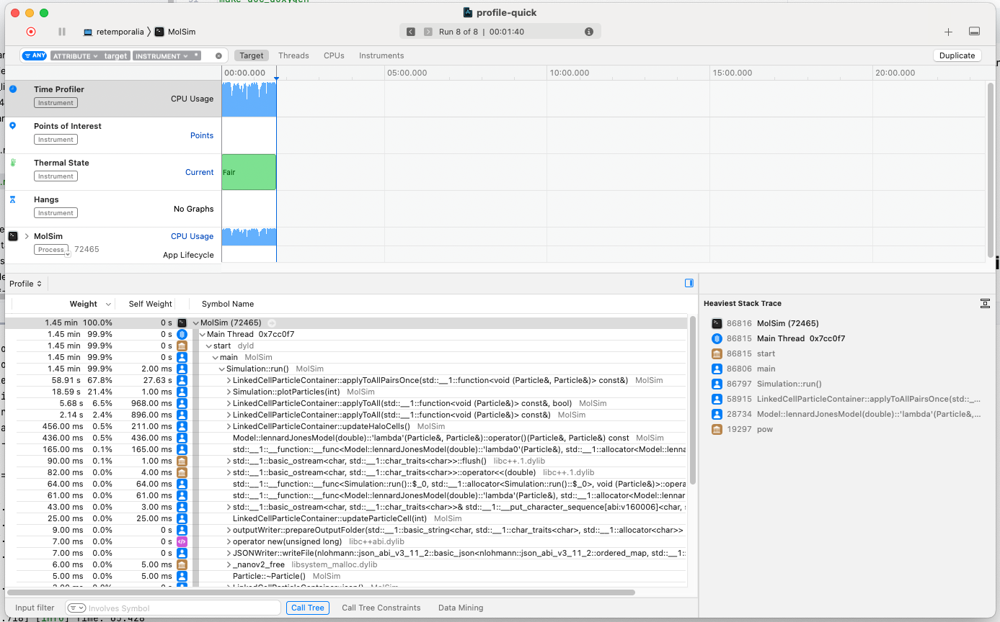

# PSE Molecular Dynamics WS23/24 - Group F

## Members
- Alp Kaan Aksu
- Berke Saylan
- Feryal Ezgi Aşkın

## Code
- Link:     https://github.com/alpkaanaksu/MolSim
- Branch:   master
- Revision: TODO

**Works with:**
- **Compiler:** clang 15.0.0
- CMake 3.27.7
- GNU Make 3.81

*Other compilers / versions would probably also work but we only tested with these.*


## Compiling and running the program
- You need `xerces-c` and `boost` (`program_options` and `filesystem`) to compile the program.

```bash
mkdir build # if it does not exist
cd build
```

```bash
ccmake ..
```

*CMake will automatically fetch some files needed for additional libraries like `googletest`, `spdlog` and `nlohmann_json`*

```bash
make
```

```bash
./MolSim ../input/rayleigh-taylor-instability/rayleigh-taylor.json
```


The last line starts the program to run the simulation of the Rayleigh-Taylor instability. You can also run a smaller version of the simulation with `quick.json`

---

### Doxygen

```bash
make doc_doxygen
```

An online version of the documentation can be found [here](https://alpkaanaksu.github.io/MolSim/).

---

## Thermostat

When incorporating gravity into our molecular dynamics simulation, it introduces a significant change. The additional force gradually increases the total energy in the system over time. This poses a problem because, in closed systems, total energy should ideally remain constant. Addressing this issue is crucial for maintaining simulation accuracy and adhering to fundamental laws governing energy conservation in physics.

To address the energy deviation problem, we've implemented a practical solution: the Velocity Rescaling Thermostat. This thermostat allows us to scale particle velocities both gradually and directly. Gradual velocity scaling is achieved by periodically calling the scaleVelocities method of the thermostat during the simulation. The scaling factor for scaleVelocities is dynamically determined based on the difference between the current temperature and the target temperature.

It's worth noting that the initialization with Brownian Motion is now optional in our implementation and can be specified as a parameter of the thermostat in the input file.

Our thermostat implementation incorporates a safeguard against division by zero when handling 'invalid' current temperatures concerning the scaling factor, such as zero $\sqrt{\frac{T_{\text{new}}}{T_{\text{current}}}}$ . While our current implementation covers these scenarios, future extensions may include handling negative temperatures.

Looking ahead, we plan to implement Google Mocks for testing the relationship between the run() method of the Simulation and the temperature scaling performed by the thermostat. This could involve checking the expected number of method calls for different inputs, ensuring the robustness of our simulation.


## Periodic Boundaries

To achieve the periodic boundary behaviour in the code, we have implemented a method called `handlePeriodicBoundary`, which ensures that the input particle seamlessly wraps around the simulation space when it reaches a boundary. For this method, we have implemented two helper methods: `updatePositionOnUpperPeriodic` and `updatePositionOnLowerPeriodic`. 

The purpose of the `updatePositionOnUpperPeriodic` function is to adjust the position of a particle when it crosses the upper boundary along a certain axis. Based on the current position of the particle and the corresponding axis index, the function calculates the `maxSize` of the axis for which the particle has crossed the boundary. It then returns the updated position of the particle by subtracting the `maxSize` from the current position. This process causes the particle to reappear at the lower end of the periodic boundary along the specified axis. 

Similarly, the `updatePositionOnLowerPeriodic` function handles the case where a particle exceeds the lower limit along a particular axis and brings it to the upper end  (maximum possible coordinate inside the simulation) of the periodic limit along the specified axis. 

The `handlePeriodicBoundary` function starts by capturing the current position of the particle. It then checks whether the particle has exceeded the limits along the X, Y and Z axes. If this is the case and the behaviour of the respective boundary is set to "Periodic", it calls the corresponding auxiliary function to update the position of the particle. For example, if the X coordinate of the particle exceeds the right boundary and the periodic behaviour is activated for that boundary, the function calls `updatePositionOnUpperPeriodic` to adjust the X coordinate. The same logic applies to the Y and Z axes to ensure that the particles smoothly wrap around the simulation space and maintain a continuous and periodic simulation environment. 

In simulations with periodic boundary conditions, maintaining particle continuity across boundaries involves managing the migration between the boundary and halo layers on opposite sides. The `updateHaloCells` method plays a crucial role in synchronizing halo cells with the current state of boundary cells in the particle container. 

To accomplish this task, the method utilizes the `upperBoundaryToLowerHaloOneAxis` and `lowerBoundaryToUpperHaloOneAxis` functions. It first checks if a boundary is periodic; if so, it activates the corresponding auxiliary function. This auxiliary function is responsible for copying particles from boundary cells to halo cells along each axis. 

The `lowerBoundaryToUpperHaloOneAxis` method does the following steps: it converts the parameter boundary cell index to a 3D index, then sets the position along the specified axis to the maximum cell index (representing the respective upper halo cell). Subsequently, it converts the updated 3D index back to a 1D index, reflecting the upper halo cell. Lastly, the method iterates through all particles in the lower boundary cell, generating new particles with updated positions, identical velocity, mass, and other properties. These new particles are then added to the upper halo cell using the `addParticleToCell` method. The `upperBoundaryToLowerHaloOneAxis` method operates analogously but in the opposite direction of the boundaries. 

As a concrete example, if the left boundary (x = 0.0) is periodic, the algorithm copies particles from boundary cells with x-index 0 to the halo cells with x-index xCells-1. Here, `xCells` represents the total number of cells along the x-axis in the simulation, including inner, boundary, and halo cells. 

Along implementation of the periodic boundaries, we have also made some changes to the reflection implementation. The algorithm has remained the same, but we have removed some of the auxiliary functions that made the code unreadable rather than readable, moreover our new implementation covers the edge case where a particle is moving so fast that we need to reflect it more than once in the same iteration.

## Gravitational Force
We added a new static method called `verticalGravityForce` to our `Model` class. Given `m`, this method calculates the gravitational force for a particle. We add the resulting vector to the force vector of the particles in each step, together with the Lennard-Jones force. 

## Lorentz-Berthelot Mixing Rules
We added two new attributes to the Particle class: `epsilon` and `sigma`, they used to be global simulation parameters, but now they are specific particles. This makes it possible to simulate substances of different types.

We made a small change in the `force` function of the `lennardJonesModel` (see `Model.h`), before we do the usual calculation.

## Rayleigh-Taylor Instability

We implemented the Rayleigh-Taylor instability as described in the exercise sheet. Two cuboids represent the two fluids, one is heavier than the other. The heavier fluid is on top of the lighter one. The simulation starts with a small perturbation in the interface between the two fluids. The heavier fluid starts to fall down and the lighter fluid starts to rise up. The interface between the two fluids becomes more and more unstable and the fluids start to mix.

See `rayleigh-taylor-instability.mp4` for the simulation. We also included two simulation of the 'quicker' version of this simulatiom (first part of the task), which shows the difference between running the simulation with and without a thermostat.

## Checkpointing

We save all the particles in a JSON file. This happens automatically after each simulation. But you can also specify times to save chekpoints by adding ,e.g., `"checkpoints": [1, 3, 5]` to the simulation object in a simulation file. In order to include particles from a checkpoint in the simulation, you can add a checkpoint object:

```json
{
    "type": "checkpoint",
    "path": "path/to/checkpoint.cp.json"
}
```

The path to the checkpoint file is relative to the location of the simulation file.

## Falling Drop

We first equilibrated the liquid as described in `liquid/liquid_equilibration.json`. `liquid.cp.json` is the checkpoint our program generated at the end of the equilibration process. `liquid_and_drop.json` describes a simulation with a disk and the equilibrated liquid. The equilibrated cuboid really looks like a liquid. We spotted a potential problem in our simulations, where the liquid 'sinks' to the bottom again. This is not what we were expecting. This does not happen if we use a thermostat in the post-equilibration simulation, but this messes up the fall of the drop and the problem statement explicitly states that we should run the simulation without a thermostat.

## Performance / Profiling

We used the `std::chrono` to measure the runtime of the main loop in `Simulation::run()`. We also calculate the MUP/s (molecule updates per second). We print the duration and MUP/s at the end of the simulation.

We used `quick.json` (1400 particles) and `performance/rayleigh-taylor-1000.json` (10000) for inspecting the performacne.

For example, we got the following for `quick.json`:

```txt
[2023-12-21 21:25:52.718] [info] Time: 65.428
[2023-12-21 21:25:52.718] [info] MUP/s: 1069898.036477
```

---

We sadly did not have access to a Linux machine. Our options were using WSL or the Rechnerhalle. Both of them are not so nice to work with. So we searched for profiling tools for macOS. The results should be similar on different machines and different platforms. Apple develops a profiler called *Instruments* that comes with Xcode, which was actually kind of practicle and pleasant to use. We used the time profiler and the CPU profiler our executable. We exported the results to a `.trace` file (we tried pushing it to the repo but it was recognized as a folder consisting of ~1940 files), we are also not sure if you can open it on a Linux machines, so here is a screenshot:



(*We can send the `.trace` file per email if you need it.*) We will probably use `perf` when we get access to the Linux cluster.

We identified that the costly functions are `applyToAll`, `applyToAllPairsOnce` and the force calculation.

### Attempt for optimization

We decided modifying the iteration approach in the `applyToAllPairs` method. Originally, we looped through all neighbors in the x, y, and z axes, including both positive and negative directions. To optimize this, we decided to iterate only in the positive direction (0 <= 1) for each axis. This change eliminated the need for the check `&p1 < &p2` since the function wouldn't be applied twice to the same pair in this algorithm.

This adjustment theoretically aimed to enhance performance without altering the simulation outcome. We indeed observed an improvement in performance, however the simulation behavior differed significantly for a reason we couldn't find (yet), therefore the profiling results became useless for a simulation with incorrect behavior, that's why we disregarded them.

We also tried summing up several calls to `applyToAll` to a single one (this is the version we hand in), but this did not improve the performance, the results were roughly the same as before (similar runtime, MUP/s and profile).
