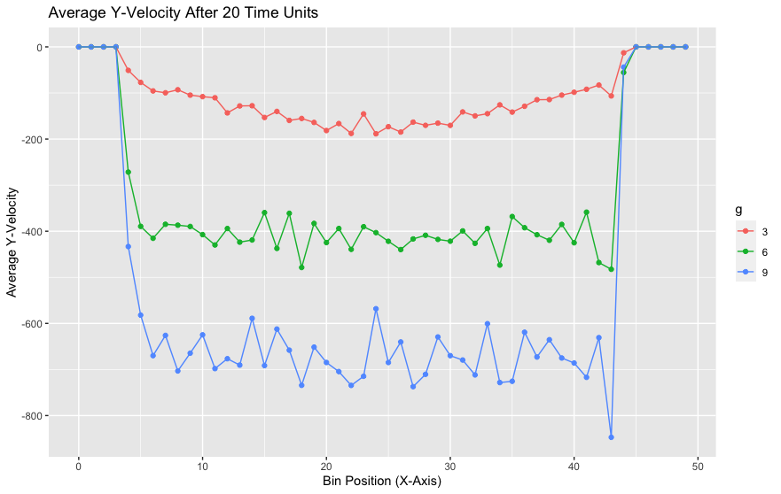
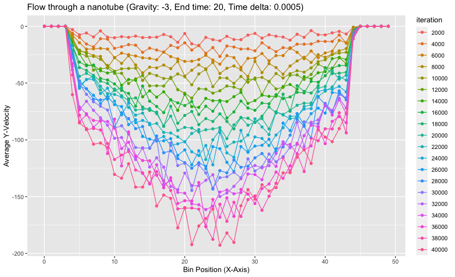
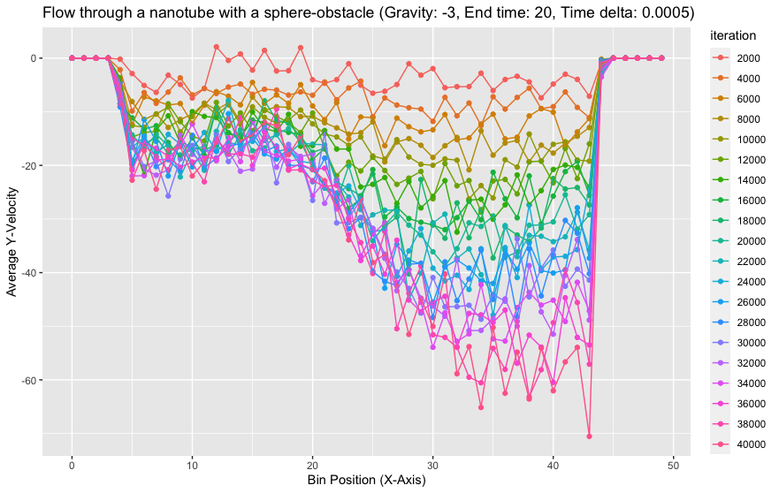

# PSE Molecular Dynamics WS23/24 - Group F

## Members

- Alp Kaan Aksu
- Berke Saylan
- Feryal Ezgi Aşkın

## Code

- Link:     https://github.com/alpkaanaksu/MolSim
- Branch:   master
- Revision: 35d61c5dfe2e5e20d47b182a88764ed6029b2ffc

**Works with:**

- **Compiler:** clang 15.0.0
- CMake 3.27.7
- GNU Make 3.81

*Other compilers / versions would probably also work but we only tested with these.*

## Compiling and running the program

- You need `xerces-c` and `boost` (`program_options` and `filesystem`) to compile the program.

```bash
mkdir build # if it does not exist
cd build
```

```bash
ccmake ..
```

*CMake will automatically fetch some files needed for additional libraries like `googletest`, `spdlog`
and `nlohmann_json`*

```bash
make
```

```bash
./MolSim ../input/sphere.json
```

The last line starts the program to run the simulation specified in `input/sphere.json` with the parameters defined in
the JSON file. It is the simulation of a drop falling against a reflective boundary, it uses our new
LinkedCellParticleContainer.

---

`./MolSim --help` shows you all possible CLI arguments.

### Doxygen

```bash
make doc_doxygen
```

An online version of the documentation can be found [here](https://alpkaanaksu.github.io/MolSim/).

## Simulation Description in JSON

(*See sheet 2 report for more details on how we implemented this.*)

We decided to continue using JSON for our input files since we already had a working implementation.

### Structure of Input Files

The general structure remains the same: the object has a `simulation` and an `objects` field. `simulation` includes all
meta information about the simulation, including information about the particle container. `objects` includes all
objects that are part of the simulation, currently, objects can be single particles, cuboids, spheres or disks. For
cuboids, spheres and disks, corresponding functions from the `Generator` namespace, e.g. `Generator::disk`, are used to
add multiple particles to the container.

Setting the output interval is currently only indirectly possible by setting the `video_duration` and `frame_rate`
fields in the `simulation` object. Allowing direct input of the output interval would be trivial, but we wanted to **
keep our program opinionated** in this regard: We only use the output files for visualizing our particles in ParaView,
specifying the output interval would be an indirect way of influencing the duration and frame rate of the video. We let
the user have **meaningful control** over the output, **without any guesswork** (i.e. 'What is the optimal interval for
my ParaView configuration? Let's try some.'). But you can still let us know if you think it is crucial to be able to set
the plot interval. We also see being able to change the output folder as a better alternative to changing the base file
name, so we also decided to go with it.

### Describing a Particle Container

The `particle_container` field of the `simulation` includes all relevant information to build a particle
container. `dimensions` determine the size of the domain, `cutoff_radius` is pretty self-explanatory.

The `boundary` field is more interesting, it can be used to set boundary conditions for the container. It is possible to
specify a different value for each side (we call the sides `top`, `bottom`, `left`, `right`, `front`, `back`). You can
also use the `all` shorthand if you want all boundaries to behave the same.

Inspired by CSS, more specific 'selectors' override less specific ones. For example, if you set `all` to `reflective`
and `right` to `outflow`, the right boundary will be `outflow` and all other boundaries will be `reflective`.

```
"particle_container": {
  "type": "linked_cell",
  "dimensions": [120, 50, 3],
  "cutoff_radius": 3,
  "boundary": {
    "all": "reflective",
    "right": "outflow"
  }
},
```

## Simulation of a Membrane

### Generator class

In the Generator class we created a new method named `membrane`, which is responsible for generating particles in a
cuboid structure. The membrane method initializes particles with specific attributes, including position, velocity,
mass, and interaction parameters. Neighbors are determined based on the cuboid structure, distinguishing between direct
and diagonal neighbors. Furthermore in this method the particles are determined, which are pulled by an external force
for a time period.

In the `membrane` method a nested loop structure is employed to iterate over neighboring particles in a 2D grid. The
outer loop, for the x-axis iteration, and the inner loop, z-axis iteration, iterate through the possible relative
positions of neighboring particles. The conditional statement within the loops ensures that the current particle is
skipped (not considered as its own neighbor). The variables nx and nz are then used to calculate the coordinates of the
potential neighbor. Subsequent checks verify whether the calculated coordinates fall within the valid range of the grid.
If the neighbor is within the valid range, its index is determined, and further checks are performed to distinguish
between direct and diagonal neighbors. Depending on the conditions, the particles are set as the direct and diagonal
neighbors of the respective iterated particle, by making use of the id attribute of the particles, which is determined
already in the cuboid generation step uniquely.

Here we hardcoded the iteration for only z- and x-axis, because in the last meeting it was said that we were allowed to
hardcode the membrane simulation according to the given parameters, as this will be the last iteration of the practical
course, thus there will be no use case for a more generalized membrane simulation that works according to the given axis
etc. parameters.

### Simulation class and Input file

In this class we define the external pulling force and apply it to the particles, which have the attribute pulled set to
true, for a hardcoded time period. Then we check if the simulation is a membrane one or not, depending on that we apply
the `applyToAllPairsOnceMembrane` or `applyToAllPairsOnce` methods for the correct force calculation between unique
particle pairs in the particle container.

We have made small changes in the input file for a better simulation view. Initially we have created a simulation with
the given parameters and it functioned correctly, however the simulation view was not smooth, since the gravity is
applied along the y-axis, but pulling force is applied along the z-axis. The outcome was that after some time point the
membrane folded, which in our opinion didn't provide a perfect membrane simulation view. Therefore we set the pulling
force the same but now along the y-axis and we also set the cuboid accordingly (lying on a x-z plane flatly), plus
particles to which the pulling force apply are set correctly with hardcoding in the `membrane` method. These input
parameters result in a simulation of a "napkin" being pulled up and then falling down, which in our opinion represented
a fully functioning membrane simulation better than the other simulation.

### LinkedCellParticleContainer class

The `applyToAllPairsOnceMembrane` method is designed to handle particle interactions within a 3D grid structure. It
works analogously `applyToAllPairsOnce` to iterate through all the particle pairs in an efficient manner utilizing the
linked-cell data structure optimization.
This implementation however makes a distinction for particle pairs, it applies the Lennard-Jones potential truncated at
a distance of 2^(1/6) * σ (which is achieved by a newly implemented `membraneModel` in the `Model` header) for particle
pairs that are not neighbors of each other. If the condition of being a direct or diagonal neighbors is fulfilled within
particle pairs the respective harmonic potential calculation is carried out for the force calculation between
neighboring particles.

The harmonic potential is employed for both direct and diagonal neighbor interactions, adapting the force calculations
based on the specified stiffness constant and average bond length.

## Parallelism

During this practical course, we executed our program, often waiting for hours or even overnight for its completion.
This hands-on experience, more than any other exercise, highlighted the significance of parallelism in enhancing
efficiency and performance.

todo (speedup etc)

Our application performs as expected both with and without OpenMP, a validation confirmed by our suite of tests.

## Rayleigh-Taylor Instability in 3D

Essentially our implementation for the 2D case was designed to cover also the 3D case. However, we realized that within
halo particle creation we were handling only the case where only one axis is periodic. Therefore we had to rewrite the
logic for halo particle copying algorithm.
Now we are using 3 methods named `handleBoundariesOneAxis`, `handleBoundariesTwoAxes` and `handleBoundariesThreeAxes` to
handle the periodicity of the simulation. These methods are called in the `updateHaloCells` method, which is responsible
for updating the halo cells of the particle container. The `updateHaloCells` method is called in the `update` method of
the `LinkedCellParticleContainer` class, which is responsible for updating the particle container in each time step of
the simulation.
The implementation of `handleBoundariesOneAxis` is almost the same as the previous auxiliary
functions `lowerBoundaryToUpperHaloOneAxis` and `UpperBoundaryToLowerHaloOneAxis` from iteration 4. This method is
responsible for copying particles from a boundary cell to the corresponding halo cell along one specified axis (X, Y, or
Z). In order to handle corner border cell cases for multiple periodic axes, we have implemented
the `handleBoundariesTwoAxes` and `handleBoundariesThreeAxes` methods. These methods extend the functionality to handle
periodic conditions along two/three axes simultaneously, providing flexibility for 2D/3D scenarios with different
periodicity. Their implementation logic is the same as the auxiliary function handling only one axis, but they are
adjusted to function in multiple axes. `updateHaloCells` method calls these methods on boundary cells, if respective
periodicity conditions are fulfilled, to ensure the periodicity of the simulation, maintaining accurate boundary
conditions across all axes.

## Nano-Scale Flow Simulation

We opted for the nano-scale flow simulation in task 4. The addition of a new attribute,`fixed`, to the `Particle` class
helped define and clearly distinguish non-moving objects within our simulation. Since `fixed` operates at the
fundamental level
of the project (`Particle.cpp`), restructuring the existing codebase posed little challenge, given that every simulation
inherently involves particles.

Regarding the new thermostat implementation, the corresponding velocity scaling method is chosen based on whether the
input contains objects with fixed particles, cuboids, etc. If such objects exist, the method `scaleVelocitiesWithAvg` is
called; otherwise, `scaleVelocities` from the last worksheet is employed. This approach simplifies the code and
minimizes the need for modifications to accommodate future thermostats.

The striking part of this simulation was its velocity and density profiles. As the flow is downwards due to the gravity
factor and periodic boundaries, the y-component of particle velocities was of importance.



For particles that are nearest to the boundaries, the downward velocity was generally lower compared to those located in
the middle of the flow. This didn't change for varying gravity values as one would intuitively expect. The interaction
between fixed wall particles and free flowing ones is more significant the closer they are to each-other. The movable
particles, however cannot exert force on the fixed particles. This inability of movable particles to exert
force on the fixed particles prevents a transfer of momentum that could otherwise counteract the localized suppression
of acceleration. As a result, the downward velocity of particles near the boundaries remains subdued, creating a
distinctive pattern in the particle dynamics within the simulation.



We notice similarities when comparing higher gravity values to the behavior observed after some time has elapsed. The
average fluid velocity is influenced by two primary factors: temperature, which remains relatively constant due to the
thermostat, and gravity. Similar to an object in free fall, the velocity increases over time.

The profiles reminded us of the [no-slip condition](https://en.wikipedia.org/wiki/No-slip_condition), which enforces
that at a solid boundary, a viscous fluid attains zero bulk velocity. This concept has been successful in solving
problems related to bigger flows for the past two centuries. However, when dealing with fluid transport at the micro-
and nanoscale, things get more complex according to
some [research](https://www.beilstein-journals.org/bjnano/articles/12/91). In these tiny systems, there's a possibility
that liquids don't adhere perfectly to solid surfaces, causing what's known as liquid slippage. It was fascinating to
observe how our nano-scale simulation behaves at boundaries.

Placing a fixed sphere helped us observe the turbulence that occurred and had this cool plot:



We also attempted to investigate how different σ values affect the profiles using two different fluids within the same
simulation, similar to the approach in Rayleigh-Taylor instability. However, we didn't observe anything significant in
the profiles. Perhaps adhering to one variable factor at a time would have been a better approach.

## Crystallization of Argon 
We implemented the coolest part of the task with the smoothed LJ, to perform the experiments out of curiosity.